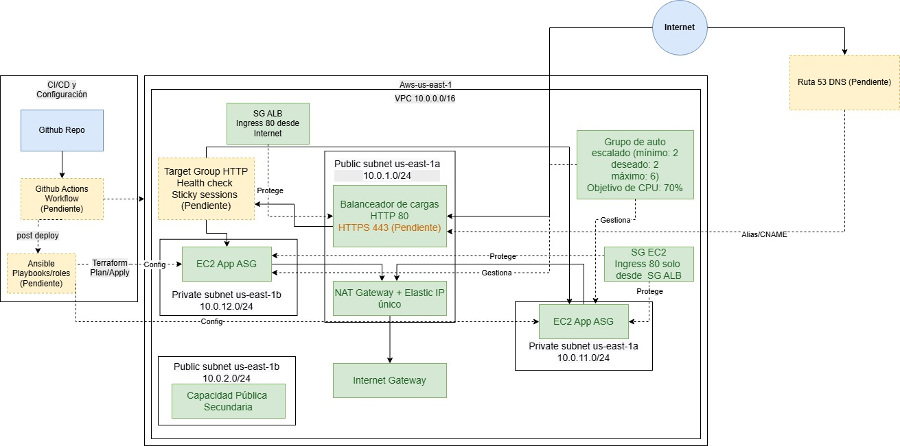
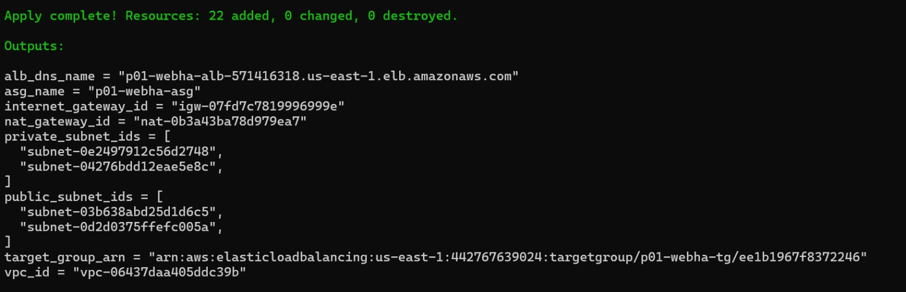
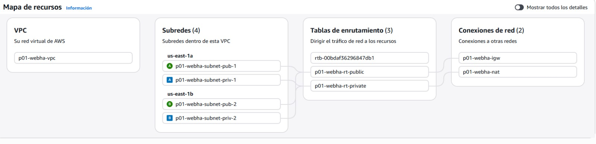
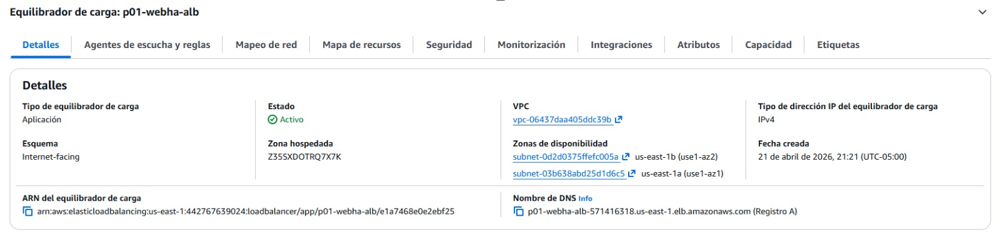
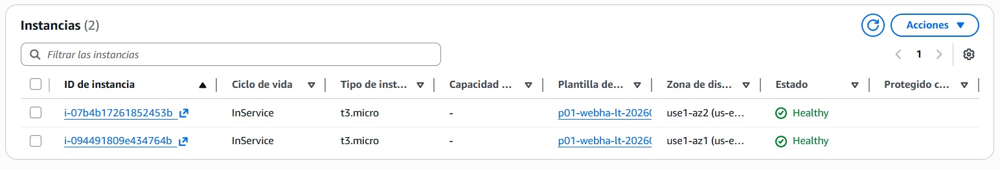
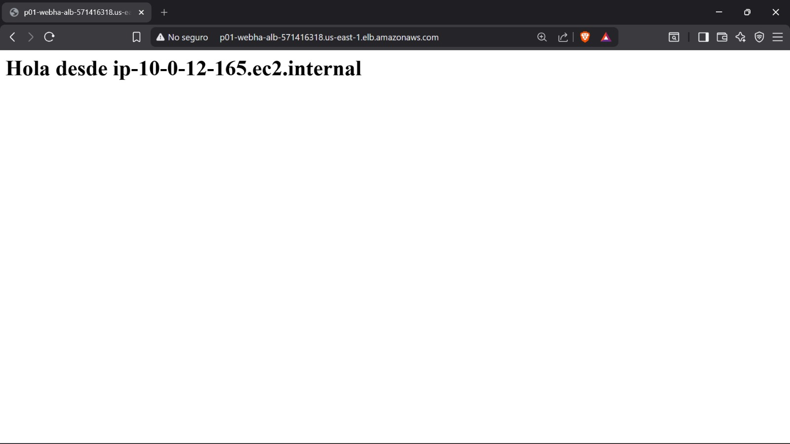

# aws-ha-webapp

Proyecto de Infraestructura como Codigo (IaC) para desplegar una aplicacion web con enfoque de alta disponibilidad en AWS.

Proyecto academico de IaC y DevOps.

- Nivel: Intermedio
- Duracion estimada: 8 semanas
- Equipo de trabajo: 5 personas

El estado actual del repositorio muestra implementacion activa en Terraform (red + computo), mientras que `ansible/`, `docs/` y `.github/workflows/` estan reservados para fases siguientes.

## 1. Finalidad del proyecto

Disenar y desplegar una plataforma base para una web app altamente disponible, escalable y reproducible, utilizando:

- Terraform para aprovisionamiento de infraestructura.
- AWS como plataforma cloud.
- Arquitectura de red segmentada (publica/privada) en multiples AZ.
- Balanceo de carga + Auto Scaling para tolerancia a fallos y elasticidad.

### Herramientas principales

| Herramienta | Proposito |
|---|---|
| Terraform | Aprovisionamiento de infraestructura en AWS |
| Ansible | Configuracion de servidores (fase siguiente) |
| GitHub Actions | Pipeline CI/CD (fase siguiente) |
| AWS EC2 | Servidores de aplicacion |
| AWS ALB | Balanceador de carga |
| AWS Auto Scaling | Escalado horizontal por demanda |
| AWS VPC | Segmentacion de red y aislamiento |

## 2. Avance actual (analisis del repositorio)

### Implementado

- Backend remoto de Terraform en S3 + bloqueo con DynamoDB.
- Modulo `network`:
  - VPC.
  - 2 subnets publicas y 2 subnets privadas en 2 zonas de disponibilidad.
  - Internet Gateway.
  - 1 NAT Gateway con EIP.
  - Tablas de ruta publica y privada con asociaciones.
- Modulo `compute`:
  - Security Group para ALB (HTTP 80 desde Internet).
  - Security Group para EC2 (HTTP 80 solo desde ALB).
  - Application Load Balancer publico.
  - Target Group + Listener HTTP.
  - Launch Template (Amazon Linux 2023) con `user_data` para Nginx.
  - Auto Scaling Group en subnets privadas.
  - Politica de escalado por CPU (Target Tracking 70%).
- Outputs principales para consumir IDs y endpoint de aplicacion.

### Pendiente / en preparacion

- Automatizacion de configuracion con Ansible (`ansible/` aun sin playbooks).
- Pipelines CI/CD con GitHub Actions (`.github/workflows/` aun sin workflows).
- Documentacion tecnica extendida en `docs/`.

## 3. Estructura del proyecto

```text
aws-ha-webapp/
├── ansible/                     # Placeholder para automatizacion de configuracion
├── docs/                        # Placeholder para documentacion adicional
├── terraform/
│   ├── backend.tf               # Estado remoto (S3 + DynamoDB lock)
│   ├── main.tf                  # Orquestacion de modulos
│   ├── variables.tf             # Variables globales
│   ├── outputs.tf               # Outputs globales
│   └── modules/
│       ├── network/             # VPC, subnets, rutas, IGW, NAT
│       └── compute/             # ALB, SG, LT, ASG, scaling
└── README.md
```

## 4. Arquitectura implementada (estado actual)

- Region por defecto: `us-east-1`.
- Dos zonas de disponibilidad: `us-east-1a`, `us-east-1b`.
- VPC: `10.0.0.0/16`.
- Subnets publicas: `10.0.1.0/24`, `10.0.2.0/24`.
- Subnets privadas: `10.0.11.0/24`, `10.0.12.0/24`.
- ALB en subnets publicas.
- Instancias EC2 del ASG en subnets privadas.
- Salida a Internet de instancias privadas via NAT Gateway.

## 5. Decisiones de diseño identificadas

1. Modularizacion por dominio (`network` y `compute`)
	- Facilita mantenimiento, evolucion y pruebas por capas.

2. Estado remoto y bloqueo de concurrencia
	- Uso de S3 para `tfstate` y DynamoDB para lock, reduciendo riesgo de corrupcion por ejecuciones simultaneas.

3. Segmentacion de red publica/privada
	- ALB expuesto en red publica.
	- Carga de aplicacion en red privada, reduciendo superficie de ataque.

4. Alta disponibilidad orientada a multiples AZ
	- Subnets distribuidas en dos AZ y ASG desplegado sobre ambas privadas.

5. Escalado automatico basado en CPU
	- Politica Target Tracking (`ASGAverageCPUUtilization = 70`) para elasticidad.

6. Trade-off costo vs disponibilidad del egreso privado
	- Se usa un solo NAT Gateway (menor costo).
	- Riesgo conocido: punto unico de falla para salida a Internet desde subnets privadas.

7. Bootstrap simple de aplicacion via `user_data`
	- Instalacion de Nginx y pagina de prueba para validar flujo extremo a extremo rapido.

## 6. Tabla de recursos Terraform

### 6.1 Modulo network

| Recurso | Tipo | Cantidad | Proposito |
|---|---|---:|---|
| `aws_vpc.main` | VPC | 1 | Red principal del proyecto |
| `aws_subnet.public` | Subnet publica | 2 | Exponer ALB y recursos publicos |
| `aws_subnet.private` | Subnet privada | 2 | Alojar capacidad de aplicacion (ASG) |
| `aws_internet_gateway.main` | Internet Gateway | 1 | Conectividad Internet para red publica |
| `aws_eip.nat` | Elastic IP | 1 | IP publica para NAT Gateway |
| `aws_nat_gateway.main` | NAT Gateway | 1 | Egreso de subnets privadas |
| `aws_route_table.public` | Route Table | 1 | Ruta 0.0.0.0/0 hacia IGW |
| `aws_route_table.private` | Route Table | 1 | Ruta 0.0.0.0/0 hacia NAT |
| `aws_route_table_association.public` | Asociacion RT | 2 | Asociar subnets publicas a RT publica |
| `aws_route_table_association.private` | Asociacion RT | 2 | Asociar subnets privadas a RT privada |

### 6.2 Modulo compute

| Recurso | Tipo | Cantidad | Proposito |
|---|---|---:|---|
| `data.aws_ami.amazon_linux` | Data source AMI | 1 | Obtener AMI Amazon Linux 2023 mas reciente |
| `aws_security_group.alb` | Security Group | 1 | Permitir HTTP 80 desde Internet al ALB |
| `aws_security_group.ec2` | Security Group | 1 | Permitir HTTP 80 solo desde SG del ALB |
| `aws_lb_target_group.main` | Target Group | 1 | Grupo destino para trafico HTTP |
| `aws_lb.main` | Application Load Balancer | 1 | Distribuir trafico a instancias del ASG |
| `aws_lb_listener.http` | Listener HTTP | 1 | Regla de entrada al ALB en puerto 80 |
| `aws_launch_template.main` | Launch Template | 1 | Plantilla de instancias (AMI, tipo, SG, user_data) |
| `aws_autoscaling_group.main` | Auto Scaling Group | 1 | Escalado horizontal sobre subnets privadas |
| `aws_autoscaling_policy.cpu` | ASG Policy | 1 | Escalado dinamico por metrica de CPU |

## 7. Variables y valores actuales relevantes

| Variable | Valor actual |
|---|---|
| `aws_region` | `us-east-1` |
| `project_name` | `p01-webha` |
| `environment` | `dev` |
| `student` | `wassadenya`|
| `instance_type` | `t3.micro` |
| `asg_min_size` | `2` |
| `asg_desired_size` | `2` |
| `asg_max_size` | `6` |

## 8. Outputs esperados

| Output | Descripcion |
|---|---|
| `vpc_id` | ID de la VPC |
| `public_subnet_ids` | IDs de subnets publicas |
| `private_subnet_ids` | IDs de subnets privadas |
| `internet_gateway_id` | ID del Internet Gateway |
| `nat_gateway_id` | ID del NAT Gateway |
| `alb_dns_name` | DNS publico para acceder a la app |
| `asg_name` | Nombre del ASG |
| `target_group_arn` | ARN del target group |

## 9. Como desplegar (Terraform)

Prerrequisitos minimos:

- Terraform >= 1.0
- Credenciales AWS configuradas
- Bucket S3 existente para estado remoto: `p01-webha-tfstate`
- Tabla DynamoDB existente para lock: `p01-webha-tflock`

1. Entrar al directorio Terraform.
2. Inicializar backend y proveedores.
3. Validar configuracion.
4. Generar plan.
5. Aplicar cambios.

```bash
cd terraform
terraform init
terraform validate
terraform plan -out=tfplan
terraform apply tfplan
terraform output

# Opcional para evitar costos al finalizar pruebas
terraform destroy
```

## 10. Diagrama actualizado



## 11. Evidencias del despliegue

### 11.1 Apply realizado



Muestra la salida final de `terraform apply` con `Apply complete! Resources: 22 added, 0 changed, 0 destroyed` y los outputs principales (`alb_dns_name`, `asg_name`, `vpc_id`, subnets, `target_group_arn`).

Esta evidencia confirma que la infraestructura fue aprovisionada de forma reproducible con IaC.

### 11.2 Mapa de recursos en la VPC



Se observa la VPC `p01-webha-vpc`, las 4 subredes (2 publicas y 2 privadas), las tablas de enrutamiento y las conexiones de red (`igw` y `nat`).

Esta evidencia valida la segmentacion de red y el diseno multi-AZ requerido para alta disponibilidad.

### 11.3 Equilibrador de cargas



La captura muestra el ALB `p01-webha-alb` en estado `Activo`, tipo `Application`, esquema `internet-facing` y asociado a dos zonas de disponibilidad.

Esta evidencia confirma que existe un punto de entrada unico para distribuir trafico y tolerar fallos por zona.

### 11.4 Dos instancias en healthy



Se visualizan 2 instancias EC2 del Auto Scaling Group en estado `InService` y `Healthy`.

Esta evidencia demuestra redundancia minima operativa y capacidad inicial de continuidad del servicio.

### 11.5 Prueba del ALB



La URL publica del ALB responde correctamente con la pagina de Nginx (`Hola desde ...`), confirmando que el trafico llega a las instancias de backend.

Esta evidencia valida el flujo end-to-end desde Internet hasta la capa de aplicacion.

## 12. Estado de madurez y siguientes hitos

- IaC base de red y computo: implementada.
- Endurecimiento de seguridad (TLS/WAF/SSM/Bastion): pendiente.
- Automatizacion de configuracion con Ansible: pendiente.
- CI/CD con GitHub Actions: pendiente.
- Documentacion visual final y evidencias de despliegue: pendiente.

