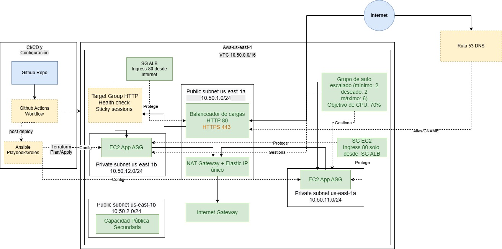
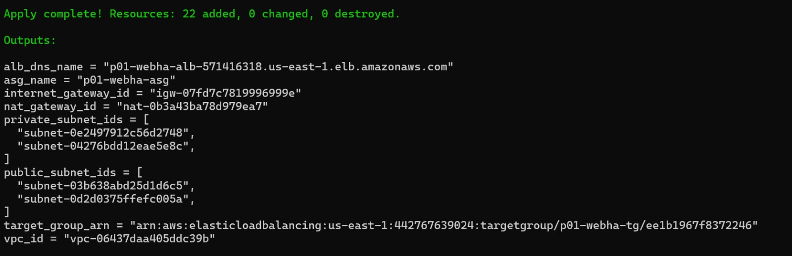
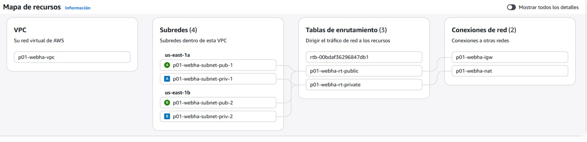
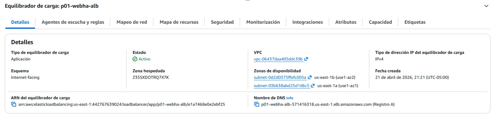
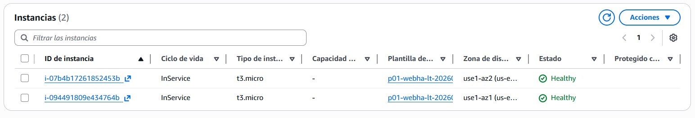
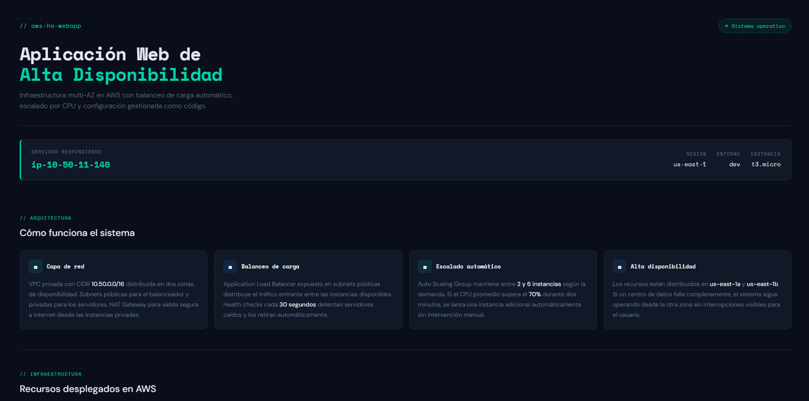
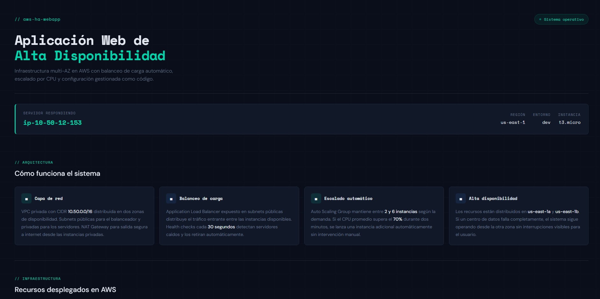

# aws-ha-webapp

Proyecto de Infraestructura como Codigo (IaC) para desplegar una aplicacion web con alta disponibilidad en AWS usando ALB, Auto Scaling y red segmentada.

Proyecto academico de IaC y DevOps.

- Nivel: Intermedio
- Duracion estimada: 8 semanas
- Equipo de trabajo: 5 personas

## 1. Finalidad del proyecto

Disenar y desplegar una plataforma base para una web app altamente disponible, escalable y reproducible, utilizando:

- Terraform para aprovisionamiento de infraestructura.
- AWS como plataforma cloud.
- Arquitectura de red segmentada (publica/privada) en multiples AZ.
- Balanceo de carga + Auto Scaling para tolerancia a fallos y elasticidad.

### Herramientas principales

| Herramienta | Proposito |
|---|---|
| Terraform | Aprovisionamiento de infraestructura en AWS |
| Ansible | Configuracion de servidores |
| GitHub Actions | Pipeline CI/CD |
| AWS EC2 | Servidores de aplicacion |
| AWS ALB | Balanceador de carga |
| AWS Auto Scaling | Escalado horizontal por demanda |
| AWS VPC | Segmentacion de red y aislamiento |
| AWS S3 + DynamoDB | Backend remoto y bloqueo de estado |


## 2. Estructura del proyecto

```text
aws-ha-webapp/
├── .github/
│   └── workflows/
│       ├── ci-cd.yml          # Pipeline principal (validate/plan/apply/configure)
│       └── infra-pipeline.yml # Pipeline alterno (pendiente unificacion)
├── ansible/
│   ├── ansible.cfg
│   ├── inventory.aws_ec2.yml
│   ├── playbook.yml
│   ├── group_vars/
│   │   ├── dev.yml
│   │   └── prod.yml
│   └── roles/
│       ├── common/
│       ├── webserver/
│       └── deploy/
├── docs/
├── terraform/
│   ├── backend.tf
│   ├── main.tf
│   ├── variables.tf
│   ├── outputs.tf
│   ├── .tflint.hcl
│   └── modules/
│       ├── network/
│       └── compute/
└── README.md
```

## 4. Arquitectura implementada (estado actual)

- Region: us-east-1.
- Zonas: us-east-1a, us-east-1b.
- VPC: 10.50.0.0/16.
- Subnets publicas: 10.50.1.0/24, 10.50.2.0/24.
- Subnets privadas: 10.50.11.0/24, 10.50.12.0/24.
- ALB en subnets publicas.
- ASG en subnets privadas (min 2, desired 2, max 6).
- Bastion en subnet publica para acceso SSH.
- Sticky sessions habilitadas en el Target Group (lb_cookie, 86400s).
- Egreso desde privadas via NAT Gateway (un solo NAT).

## 5. Decisiones de diseño

1. Modularizacion por dominio (network y compute)
   - Facilita mantenimiento, evolucion y pruebas por capas.
2. Estado remoto y bloqueo de concurrencia
   - S3 para tfstate + DynamoDB para lock.
3. Segmentacion publica/privada
   - ALB en publicas y app en privadas.
4. Alta disponibilidad multi-AZ
   - Subnets distribuidas en 2 AZ y ASG sobre privadas.
5. Sticky sessions en el ALB
   - Session affinity por lb_cookie en el Target Group.
6. Bastion Host como salto SSH
   - Permite a Ansible acceder a instancias privadas.
7. Trade-off costo vs disponibilidad
   - NAT unico para egreso de privadas (punto unico de falla).

## 6. Terraform: recursos principales

### 6.1 Modulo network

| Recurso | Tipo | Cantidad | Proposito |
|---|---|---:|---|
| aws_vpc.main | VPC | 1 | Red principal del proyecto |
| aws_subnet.public | Subnet publica | 2 | Exponer ALB y bastion |
| aws_subnet.private | Subnet privada | 2 | Alojar capacidad de aplicacion (ASG) |
| aws_internet_gateway.main | Internet Gateway | 1 | Conectividad Internet para red publica |
| aws_eip.nat | Elastic IP | 1 | IP publica para NAT Gateway |
| aws_nat_gateway.main | NAT Gateway | 1 | Egreso de subnets privadas |
| aws_route_table.public | Route Table | 1 | Ruta 0.0.0.0/0 hacia IGW |
| aws_route_table.private | Route Table | 1 | Ruta 0.0.0.0/0 hacia NAT |
| aws_route_table_association.public | Asociacion RT | 2 | Asociar subnets publicas a RT publica |
| aws_route_table_association.private | Asociacion RT | 2 | Asociar subnets privadas a RT privada |

### 6.2 Modulo compute

| Recurso | Tipo | Cantidad | Proposito |
|---|---|---:|---|
| data.aws_ami.amazon_linux | Data source AMI | 1 | AMI Amazon Linux 2023 |
| aws_security_group.alb | Security Group | 1 | Permitir HTTP/HTTPS desde Internet al ALB |
| aws_security_group.ec2 | Security Group | 1 | Permitir HTTP solo desde SG del ALB |
| aws_security_group.bastion | Security Group | 1 | Permitir SSH solo desde allowlist |
| aws_lb_target_group.main | Target Group | 1 | Grupo destino HTTP + stickiness |
| aws_lb.main | Application Load Balancer | 1 | Distribuir trafico |
| aws_lb_listener.http | Listener HTTP | 1 | Entrada en puerto 80 |
| aws_launch_template.main | Launch Template | 1 | Plantilla de instancias (AMI, SG, user_data) |
| aws_autoscaling_group.main | Auto Scaling Group | 1 | Escalado horizontal |
| aws_autoscaling_policy.cpu | ASG Policy | 1 | Escalado por CPU |
| aws_instance.bastion | EC2 Bastion | 1 | Salto SSH para privadas |

## 7. Ansible

- Inventario dinamico con amazon.aws.aws_ec2 filtrando por tags (Name y Environment).
- Roles:
  - common: actualiza paquetes, utilitarios y timezone.
  - webserver: instala Nginx, configura firewalld y habilita servicio.
  - deploy: despliega pagina estatica desde template.
- Nota: ansible.cfg usa ProxyCommand con BASTION_PUBLIC_IP y debe actualizarse con la IP real del bastion antes de ejecutar.

## 8. CI/CD (GitHub Actions)

- ci-cd.yml:
  - validate: fmt, validate, tflint.
  - plan: comentario del plan en PR.
  - apply: apply en main con approval (environment production).
  - configure: ejecuta Ansible; autoriza la IP del runner en el SG del bastion y crea un SSH config temporal.
- infra-pipeline.yml:
  - pipeline alterno con validate/plan/apply/configure.
  - usa secrets distintos (ANSIBLE_PRIVATE_KEY + BASTION_PUBLIC_IP).


## 9. Variables y valores actuales relevantes

| Variable | Valor actual |
|---|---|
| aws_region | us-east-1 |
| project_name | p01-webha |
| environment | dev |
| student | wassadenya |
| instance_type | t3.micro |
| asg_min_size | 2 |
| asg_desired_size | 2 |
| asg_max_size | 6 |
| key_name | p01-webha-key |
| bastion_allowed_ip | allowlist de IPs publicas |

## 10. Outputs esperados

| Output | Descripcion |
|---|---|
| vpc_id | ID de la VPC |
| public_subnet_ids | IDs de subnets publicas |
| private_subnet_ids | IDs de subnets privadas |
| internet_gateway_id | ID del Internet Gateway |
| nat_gateway_id | ID del NAT Gateway |
| alb_dns_name | DNS publico del ALB |
| asg_name | Nombre del ASG |
| target_group_arn | ARN del Target Group |
| bastion_public_ip | IP publica del Bastion Host |

## 11. Como desplegar (Terraform)

Prerequisitos minimos:

- Terraform >= 1.0
- Credenciales AWS configuradas
- Bucket S3 existente para estado remoto: p01-webha-tfstate
- Tabla DynamoDB existente para lock: p01-webha-tflock

1. Entrar al directorio Terraform.
2. Inicializar backend y proveedores.
3. Validar configuracion.
4. Generar plan.
5. Aplicar cambios.

```bash
cd terraform
terraform init
terraform validate
tflint --init
tflint
terraform plan -out=tfplan
terraform apply tfplan
terraform output

# Opcional para evitar costos al finalizar pruebas
terraform destroy
```

## 11. Diagrama actualizado



## 12. Evidencias del despliegue

### 12.1 Apply realizado



Muestra la salida final de `terraform apply` con `Apply complete! Resources: 22 added, 0 changed, 0 destroyed` y los outputs principales (`alb_dns_name`, `asg_name`, `vpc_id`, subnets, `target_group_arn`).

Esta evidencia confirma que la infraestructura fue aprovisionada de forma reproducible con IaC.

### 12.2 Mapa de recursos en la VPC



Se observa la VPC `p01-webha-vpc`, las 4 subredes (2 publicas y 2 privadas), las tablas de enrutamiento y las conexiones de red (`igw` y `nat`).

Esta evidencia valida la segmentacion de red y el diseno multi-AZ requerido para alta disponibilidad.

### 12.3 Equilibrador de cargas



La captura muestra el ALB `p01-webha-alb` en estado `Activo`, tipo `Application`, esquema `internet-facing` y asociado a dos zonas de disponibilidad.

Esta evidencia confirma que existe un punto de entrada unico para distribuir trafico y tolerar fallos por zona.

### 12.4 Dos instancias en healthy



Se visualizan 2 instancias EC2 del Auto Scaling Group en estado `InService` y `Healthy`.

Esta evidencia demuestra redundancia minima operativa y capacidad inicial de continuidad del servicio.

### 12.5 Prueba del ALB



La URL publica del ALB responde correctamente con la pagina de Nginx, confirmando que el trafico llega a las instancias de backend. Si se entra desde otro dispositivo, o incluso desde incognito, te redirige a la otra instancia disponible.



Esta evidencia valida el flujo end-to-end desde Internet hasta la capa de aplicacion.
